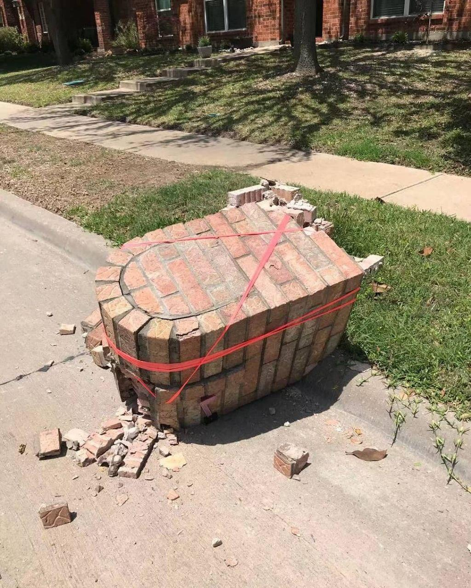
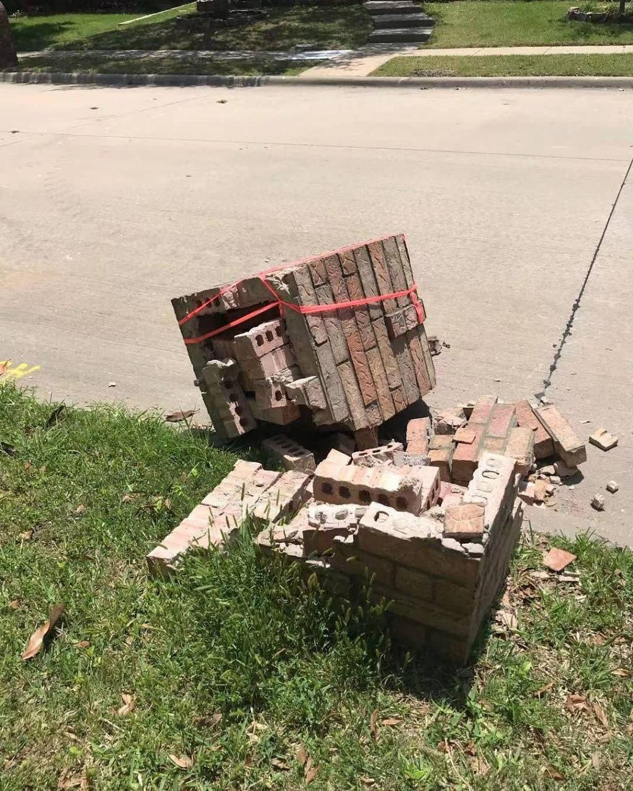
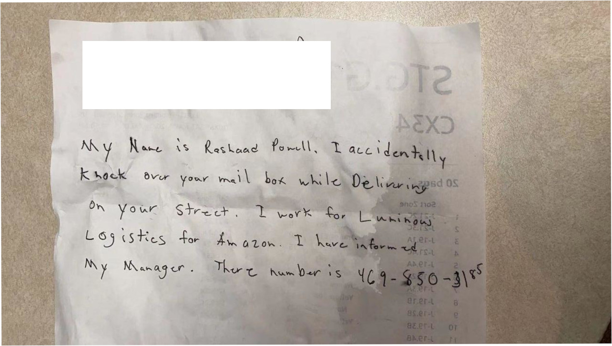
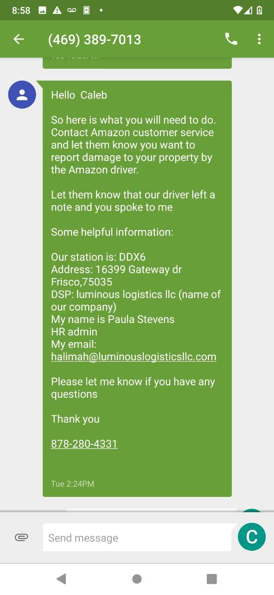
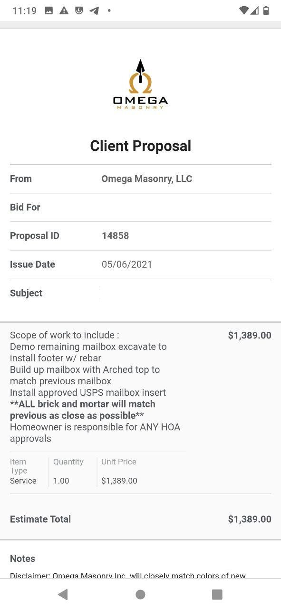

# Email correspondence with Amazon Arc

On May /1st/ 2021 an amazon driver ran over my mailbox, the day I went on vacation.

## The driver left a note on my door.

## His manager texted me after I called the number and told me I needed to contact amazon.

So I called and was told a arc team member would get back to me

## While I was doing this I got a qoute by text to fix my mailbox.

about 1400$.

## I submitted all this to arc and got the following email from a Madelon,

May/7/2021

> Hello,
> We do need some type of estimate to compensate you! If completing the repairs yourself I will need an itemized repair product invoice. This can be done by submitting an online shopping cart screen shot depicting the total repair products needed. Please be advised we do not reimburse for tools or machinery. If you are going to hire someone make sure that you have the name, address and phone number of the person doing the work on that company's letterhead.
> All the best,
> ARC

## So I replied,

May/7/2021

> I sent a image of estimate in text format. I'm attaching a more formal estimate. The price could change still of course.

## Madelon May/7/2021

> Hello,

> Please get the quote itemized for our review.

> Thank you,
> ARC

## me May/7/2021

> No brick mason in my area offers itemized quotes. Only proposals such as this.  Thats just how much a new mail box costs when it's made out of brick. If that is a problem please let me talk to your manager. I have been calling brick masons all week and need a new mailbox to get my mail.

> I am going to have to wait to get reimbursed for the mail box Amazon destroyed?  I've sent you all the evidence and quotes you need.

## Madelon: May/10/2021

> Hello,

> We do need an itemization to proceed.

> Thank you,
> ARC

## Me May/10/2021

> No Stone mason will give me an itemization. You will proceed with my estimates or receipts or proceed with my bill and my lawyers bills. Give me a phone number to your manager.

## Madelon: May/11/2021

> Helllo,

> Please provide a repair quote itemized to proceed with your claim. Thank you.

> ARC

I am currently emailing a Austin and kelly who "alexis" told me I should email after calling and complaining about this absurd behavior. Will update with what they say.

## Scott Austin Claims Supervisor email May/12th/2021

> Hello Caleb,

> I will gladly look into this for you. Can you please provide your claim number so I can review the claim?

## Me: May/12/th/2021

> Sure,

>  My claim number is AMZ2021101330

## ARC, Scott or madelon? May/13nth/2021

> Can you please advise what the cost of labor is?

> Thank you,
> ARC

## Me May/13nth/2021

> That official Quote I gave you is from Omega Masonry in Mckinney TX. Their phone number is  469 - 777-1752. You can call them and ask them yourself. They do not themselves separate the cost of brick and labor. I have text messages to show such. If you like you can divide the qoute however you want between labor and non labor. Of all the masons I called None would separate the cost. I have another quote for 3,000 from Daniel at Brick Repairs by Daniel Mcfarland in Wylie texas if you would rather call him at 214-315-2523. 

## Me May/14nth/2021

> Dear Scott, Kelly, Amazon Arc,

> It is now May 14nth, two weeks after amazon destroyed my HOA mandated
> brick mailbox. You have asked me 5 times if I could provide a itemized
> quote. and 5 times I have replied that no stone mason in my area
> provides such quotes however I have provided you with quotes from stone
> masons who show the total cost and I can provide others if you need. You
> can see this detailed in my blog here
> https://github.com/bigOconstant/amazonarc , my twitter profile here
> https://twitter.com/caleb24686539 , and my reddit post here
> https://www.reddit.com/r/mildyinfuriating/comments/nbhyfs/an_amazon_driver_knocked_over_my_mailbox/

> You have given me no indication that you will compensate me. If you
> cannot or will not compensate me for the damages done to my home by your
> driver I will have no other choice but to take my case to small claims
> court where a judge will surely side with me and my shattered mailbox. I
> hope you will offer some sort of resolution or path to resolution soon
> so I know that you are doing something other then sending useless emails
> once a day asking the same question.

> Thank you for your time,

> -Caleb McCarthy-

> 7112 Bryce Canyon Dr,
> McKinney TX
> 75072
